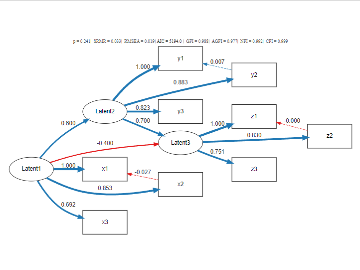

# semDiagram

R functions for visualizing structural equation models (SEM) with fit indices and path diagrams.

## Features

- Extracts model fit indices from lavaan models
- Draws SEM diagrams using DiagrammeR
- Automatically color-codes coefficients and fit indices based on thresholds

## Installation

```r
# Install required packages
install.packages(c("lavaan", "DiagrammeR", "scales"))

# Load functions
source("semDiagram.R")
```

## Examples

```r
# Loading required packages
library(lavaan)

# Loading PoliticalDemocracy dataset
data("PoliticalDemocracy")

# Defining SEM model
model <- '
  # Measurement model
  ind60 =~ x1 + x2 + x3
  dem60 =~ y1 + y2 + y3 + y4
  dem65 =~ y5 + y6 + y7 + y8

  # Structural model
  dem60 ~ ind60
  dem65 ~ ind60 + dem60

  # Residual covariances
  y1 ~~ y5
  y2 ~~ y4 + y6
  y3 ~~ y7
  y4 ~~ y8
  y6 ~~ y8
'

# Fitting the model
fit <- sem(model, data = PoliticalDemocracy)

# Summary of results (including standardized estimates)
summary(fit, standardized = TRUE)

# Visualizing the model using semDiagram() function
semDiagram(fit)
```

