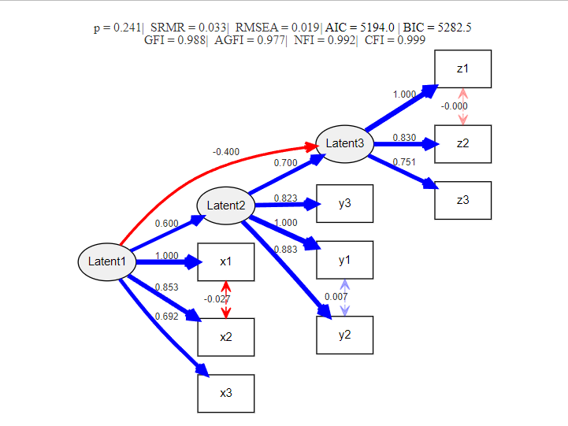

# semDiagram

R functions for visualizing structural equation models (SEM) with fit indices and path diagrams.

## Features

- Extracts model fit indices from lavaan models
- Draws SEM diagrams using DiagrammeR
- Automatically color-codes coefficients and fit indices based on thresholds

## Installation

```r
# Install required packages
install.packages(c("lavaan", "DiagrammeR", "scales"))

# Load functions
devtools::install_github("ToshihiroIguchi/semDiagram")
```

## Examples

```r
# Load necessary libraries
library(lavaan)

# Set seed for reproducibility
set.seed(123)

# Generate sample size
n <- 500

# Generate latent variables
Latent1 <- rnorm(n)
Latent2 <- 0.6 * Latent1 + rnorm(n, sd = 0.5)
Latent3 <- -0.4 * Latent1 + 0.7 * Latent2 + rnorm(n, sd = 0.5)

# Generate observed variables for Latent1
x1 <- 0.8 * Latent1 + rnorm(n, sd = 0.3)
x2 <- 0.7 * Latent1 + rnorm(n, sd = 0.3)
x3 <- 0.6 * Latent1 + rnorm(n, sd = 0.3)

# Generate observed variables for Latent2
y1 <- 0.9 * Latent2 + rnorm(n, sd = 0.3)
y2 <- 0.8 * Latent2 + rnorm(n, sd = 0.3)
y3 <- 0.7 * Latent2 + rnorm(n, sd = 0.3)

# Generate observed variables for Latent3
z1 <- 0.85 * Latent3 + rnorm(n, sd = 0.3)
z2 <- 0.75 * Latent3 + rnorm(n, sd = 0.3)
z3 <- 0.65 * Latent3 + rnorm(n, sd = 0.3)

# Create data frame
data <- data.frame(x1, x2, x3, y1, y2, y3, z1, z2, z3)

# Define SEM model
model <- '
  # Measurement model
  Latent1 =~ x1 + x2 + x3
  Latent2 =~ y1 + y2 + y3
  Latent3 =~ z1 + z2 + z3

  # Structural model
  Latent2 ~ 0.6 * Latent1
  Latent3 ~ -0.4 * Latent1 + 0.7 * Latent2

  # Covariances between observed variables
  x1 ~~ x2
  y1 ~~ y2
  z1 ~~ z2
'

# Fit the model
fit <- sem(model, data = data)

# Display summary with fit measures and standardized estimates
summary(fit, fit.measures = TRUE, standardized = TRUE)

# Visualizing the model using semDiagram() function
semDiagram(fit)
```

